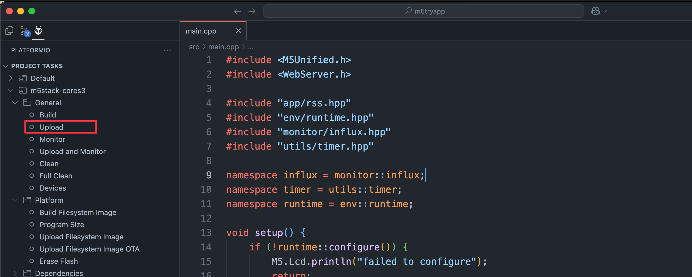

# m5tryapp

M5Stack Cores3 でいろいろするリポジトリ

[](https://github.com/enuesaa/m5tryapp/actions/workflows/ci.yml)

## 実装内容

とりあえず AWS News を取得して、画面に表示したり、AIに投げて読み上げてもらってる。

## 開発方法
VS Code に [PlatformIO extension](https://marketplace.visualstudio.com/items?itemName=platformio.platformio-ide) を入れて開発する

### 手順
1. VS Code に [PlatformIO extension](https://marketplace.visualstudio.com/items?itemName=platformio.platformio-ide) をインストールする
2. VS Code でこのリポジトリを開く  
  ---> PlatformIO が立ち上がるはず
3. M5Stack Cores3 を PC に USB 接続する
4. PlatformIO の「Upload」ボタンを押す  
    
  ---> ビルド & アップロードできるはず


## ライブラリ
### M5Unified

M5Stack の機種によってライブラリが異なっていたがそれを統一したもの、、と理解。

- https://speakerdeck.com/lovyan03/m5unifiednoshao-jie
- https://lang-ship.com/blog/work/m5unified-1/

## コマンド
### test
```bash
pio test -vvv
```

### format
```bash
clang-format -i src/**/*.{cpp,hpp}
```
